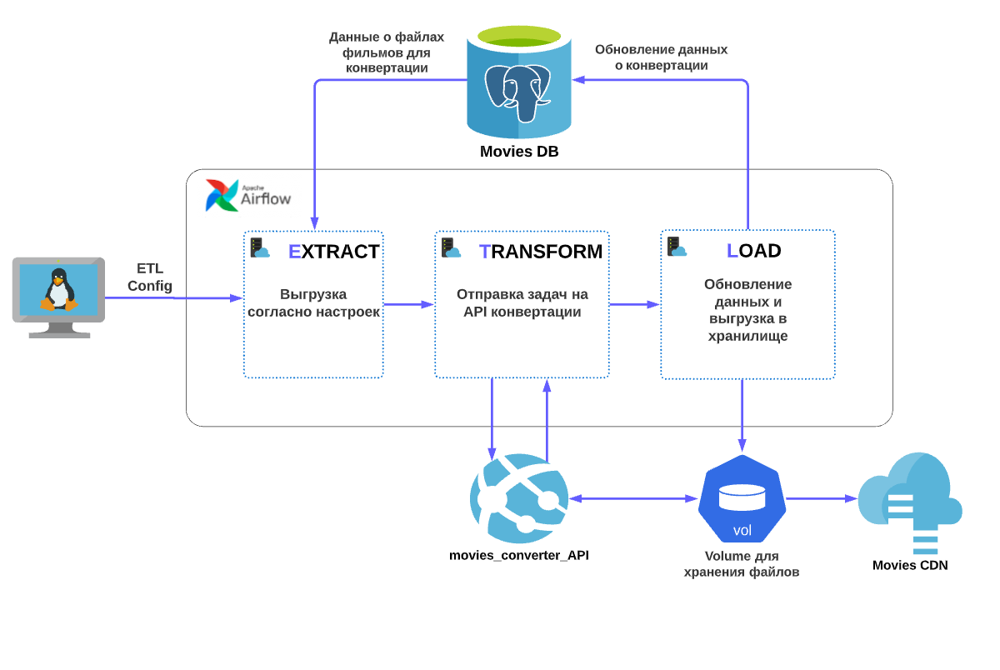

# Проектная работа: диплом

[https://github.com/dimk00z/graduate_work](https://github.com/dimk00z/graduate_work)

## Задача

Выполните проект «ETL на стероидах: динамические запросы, 
чтобы не править всё время код».

ETL хорош всем, но ему не хватает гибкости. Нельзя просто взять и поменять SQL, 
не затронув при этом код ETL. Было бы прекрасно применять новые настройки и при этом не переписывать код.

Предлагаем следующие методы управления ETL:

1. Запустить обработку ETL.
2. Остановить обработку ETL. При этом нужно обработать оставшиеся записи.
3. Обновить настройки ETL-скрипта. Сюда входит любая метаинформация: 
название таблицы, какие поля доставать, какие события обрабатывать и другие настройки.

## Реализация

### Описание реализации

Для проекта была выбрана задача автоматизировать процесс конвертации видео для онлайн-кинотеатра. Идею подсказал эксперт на встрече.

### Архитектура

* API для конвертации файлов `movies_converter_API`. 
Подробное описание в директории [movies_converter_API](movies_converter_API)

* ETL pipeline `movies_converter_ETL`. 
Подробное описание в директории [movies_converter_ETL](movies_converter_ETL/airflow)

### Выполнили

- [Дмитрий Кузнецов](https://github.com/dimk00z)
- [Дмитрий Мурдашев](https://github.com/di3mus)